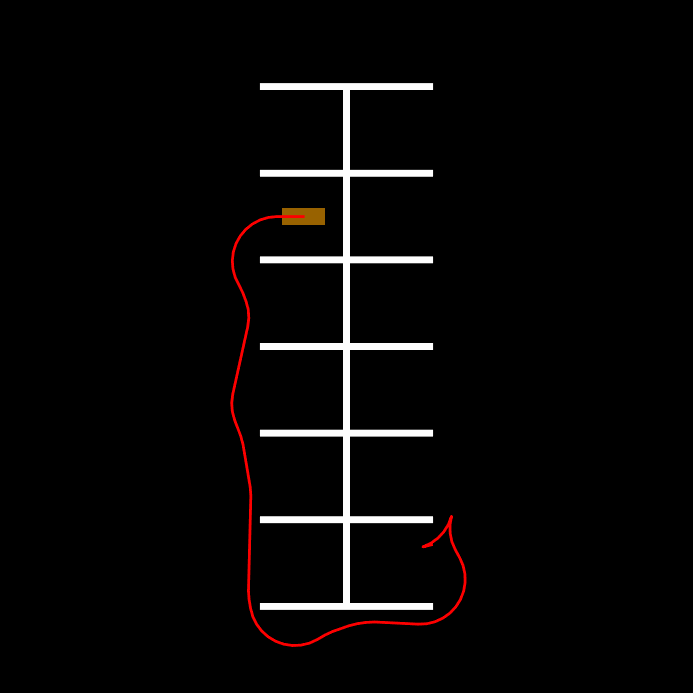

#  Hybrid A* Path Planning Demo

This repository demonstrates a Hybrid A* planner in ROS 2, with both a C++ planning node
and Python tools to publish the environment and visualize the result.

## Prerequisites

- Ubuntu 22.04 / ROS 2 Humble (or later)
- `colcon` build tool
- OMPL (install with `(https://ompl.kavrakilab.org/core/installation.html)`)
- Python packages:
  ```bash
  pip install matplotlib numpy
  ```

## Build Instructions

```bash
rosdep update
rosdep install --from-path src --ignore-src -r -y
colcon build --symlink-install
source install/setup.bash
```

## Running the Demo

Launch all three nodes with:
```bash
ros2 launch hybrid_astar astar_viz_launch.py
```
- `env_publisher.py` → publishes /map, /start, /goal

- `hybrid_astar_node (C++)` → plans and publishes /planned_path

- `path_viz.py` → animates the path on the map

## Demo


